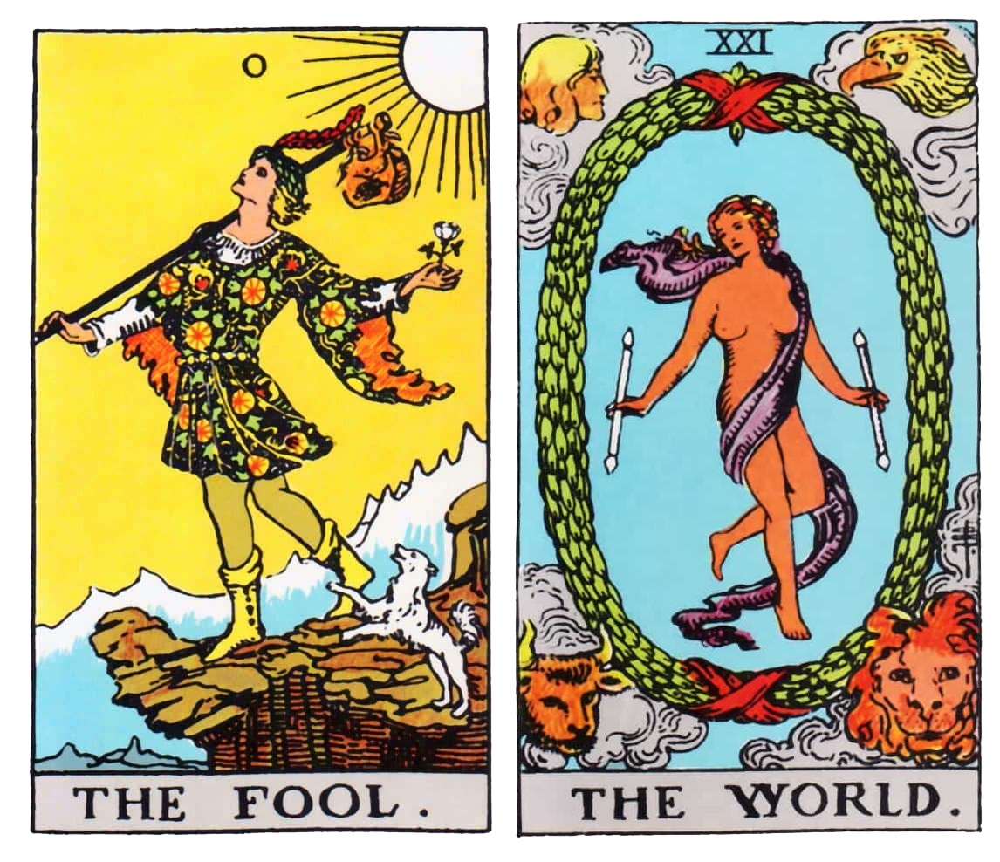

# croupier_bot
Bot discord to create a Poker game or a Quiet Year game, also distributed with a custom card atlas

The first goal of this bot was to create games of "a Quiet Year" and need a way to create custom decks.
As we didn't need it anymore, I dropped it and no longer will make the final features and make it a completed bot.

# Available Features
I created this bot originally to be able to play a game of ["A Quiet year"](https://buriedwithoutceremony.com/the-quiet-year) with friends. For those who doesn't know what this game is, it is some kind of roleplay game set around world building in a post apocalyptic environnement using a classic deck of 52 cards. But the game needs the creation of custom pool and seperate each color. I thought that this would be a good idea to create a bot for this. 

## Custom pools
It is possible to create any pool of cards with this, once you are able to divide your decks into an amount of cards, each are given an ID and you can select which cards you need in this pool. For the game, I create a set of preregistered pool :
- 52 cards pool
- 32 cards pool
- Tarot pool

## Atlas card and custom cards
You can use this with any png or jpg to create your own set custom set of cards, the deck creation use the default atlas. But you can modify it any time using yours as I used two atlas. The classic card atlas and a tarot Atlas. As you can draw cards, you could use it to send random cards and read your tarot easily. 

To create an atlas you have to create row, or a single evenly spaced line of cards, and you can set up your custom decks.

## Poker
As of now, the Poker is full integrated, you could use it, the game is already able to draw card by card filling the river, and create a pair to distribute to player randomly. And automatically delete the cards from the deck. It refills it once the game is finished and select a winner (or a draw).

The game create and send a concatenate image of all the drawn cards. And update each time a new card is drawn as shown above.

# Features not available
Right now the bot is inactive, it can not scale well as I had to define what a game is and a way for servers to not interact as there at the moment only single instance of games loaded and playable.
It can only send images in the chat, I wanted it to be able to send private messages to the user with their cards. 
A complete lack of commands to actually play it directly in the Discord chat. 
Maybe add some currency to help player gambles with some imaginary points or something. 
